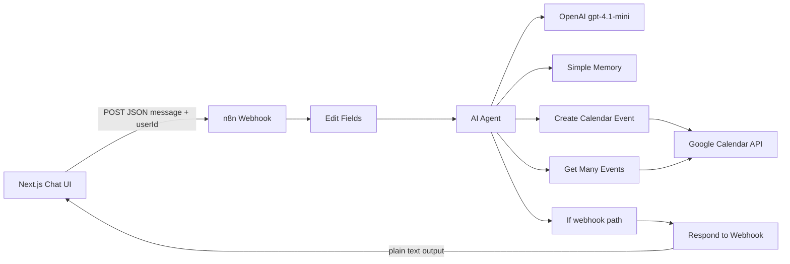

# n8n Google Calendar Agent

Natural-language Google Calendar assistant: a Next.js chat UI that talks to an n8n AI Agent workflow, which creates and retrieves events through the Google Calendar API.

The exported workflow lives in [`n8n/google_calendar_agent.json`](n8n/google_calendar_agent.json) and can be imported into any n8n instance (Cloud or self-hosted).

## Features

- **Conversational scheduling** — create events from plain English (title, start/end, optional description/location/attendees inferred by the agent when provided)
- **Calendar queries** — ask for today’s schedule, this week’s events, or a custom date range
- **Agent tooling** — LangChain AI Agent in n8n with OpenAI (`gpt-4.1-mini`) and Google Calendar tool nodes for create and list
- **Session memory** — n8n buffer memory (10-message window) keyed by `userId` / `session.id`
- **Chat UI** — responsive Next.js App Router client with markdown replies, light/dark theme, example prompts, and conversation clear

## Architecture



The frontend is a thin client. Orchestration, LLM reasoning, tool calls, OAuth to Google, and response formatting happen in n8n. The exported workflow includes both a webhook entry path and an “executed by another workflow” trigger, so it can run standalone or as a sub-workflow.

## Tech stack

| Layer | Technology |
| --- | --- |
| Frontend | Next.js 16 (App Router), React 19, TypeScript |
| UI | Tailwind CSS 4, Framer Motion, Lucide React, `react-markdown` + `remark-gfm` |
| Automation | n8n (LangChain AI Agent, Webhook, Respond to Webhook) |
| LLM | OpenAI Chat Model via n8n (`gpt-4.1-mini` in the exported workflow) |
| Calendar | Google Calendar OAuth2 tool nodes in n8n |

## Project structure

```text
├── app/                 # App Router entry (layout, page, styles)
├── components/          # Chat UI (window, input, messages, header, empty state)
├── lib/
│   ├── api.ts           # Webhook client + response parser
│   └── theme.ts         # Light/dark theme helpers
├── n8n/
│   └── google_calendar_agent.json   # Importable n8n workflow
├── scripts/
│   └── verify-api.ts    # Unit checks for parseWebhookResponse
├── types/
│   └── chat.ts          # Chat and webhook types
└── package.json
```

## How it works

1. The user sends a message in the chat UI.
2. `sendMessage` in `lib/api.ts` POSTs `{ message, userId }` to the n8n webhook.
3. n8n maps `body.message` → agent `text` and uses `userId` as the memory session key.
4. The AI Agent decides whether to create an event or list events, calls the matching Google Calendar tool, and returns a natural-language reply.
5. n8n responds with plain text (`Respond to Webhook` → `$json.output`).
6. The UI parses common n8n response shapes (plain text, JSON object/array) and renders markdown.

Supported agent capabilities in the shipped workflow: **create event** and **get many events**. Update, delete, and invite-management flows are not wired as tools.

## Prerequisites

- Node.js 20+ (recommended) and npm
- An [n8n](https://n8n.io/) instance (Cloud or self-hosted)
- OpenAI API credentials in n8n
- Google Calendar OAuth2 credentials in n8n, with access to the target calendar

## Setup

### 1. Import the n8n workflow

1. In n8n: **Workflows → Import from File**.
2. Import [`n8n/google_calendar_agent.json`](n8n/google_calendar_agent.json).
3. Attach credentials:
   - **OpenAI API** → OpenAI Chat Model node
   - **Google Calendar OAuth2** → both calendar tool nodes
4. In both Google Calendar nodes, select the calendar you want the agent to use (the export is bound to a specific demo calendar ID).
5. Activate the workflow and copy the **Production** webhook URL (prefer production over `webhook-test` for a persistent endpoint).

### 2. Point the frontend at your webhook

Edit `lib/api.ts`:

```typescript
const WEBHOOK_URL = "https://YOUR_N8N_HOST/webhook/YOUR_WEBHOOK_PATH";
const USER_ID = "your-stable-user-id";
```

`USER_ID` is sent on every request and used by n8n memory as the session key. There is no `.env` wiring yet; the URL and user id are constants in source.

### 3. Install and run the UI

```bash
npm install
npm run dev
```

Open [http://localhost:3000](http://localhost:3000).

## Request / response contract

**Request** (JSON body from the UI):

```json
{
  "message": "Schedule pickleball tomorrow at 7 PM for 1 hour",
  "userId": "raghav-demo"
}
```

**Response:** plain text assistant reply (as configured in the workflow). The client also accepts JSON shapes with `response`, `message`, `output`, `text`, or `reply`, including a one-element array of such objects.

## Scripts

| Command | Description |
| --- | --- |
| `npm run dev` | Start Next.js development server |
| `npm run build` | Production build |
| `npm run start` | Serve the production build |
| `npm run lint` | ESLint |
| `npm run test` | Run `scripts/verify-api.ts` (webhook response parser cases) |
| `npm run verify` | `test` → `lint` → `build` |

## Usage examples

Once the webhook and credentials are live, try:

- `Schedule a meeting tomorrow at 3 PM for 30 minutes`
- `Show today's events`
- `What's on my calendar this week?`
- `Create Gym at 7 PM`

The empty state includes similar quick prompts.

## Design notes

- The chat UI is client-side only; there is no Next.js API route or database.
- Clearing the conversation in the UI clears local message state only; n8n buffer memory for that `userId` is unchanged until it ages out of the window.
- `parseWebhookResponse` is defensive so either n8n text mode or JSON mode works without frontend changes.
- The workflow’s “If” node returns a webhook response only on the HTTP entry path, so the same agent graph can also be invoked as a sub-workflow.

## Limitations

- Tools cover **create** and **list** only (no update/delete/reschedule tools in the export).
- Webhook URL and `userId` are hardcoded in `lib/api.ts` (not environment-driven).
- No end-user authentication; anyone who can reach the UI and webhook can invoke the agent for the configured calendar.
- UI copy is personalized for a demo (“Hi Raghav”); adjust in `components/EmptyState.tsx` for other audiences.
- The bundled workflow may reference credential IDs and a calendar from the original n8n instance; reconnect credentials after import.

## Contributing

This repository is a compact demo/portfolio project. If you fork it, keep webhook secrets and Google OAuth credentials out of git, and prefer environment-based configuration for `WEBHOOK_URL` / `USER_ID` before sharing publicly.
